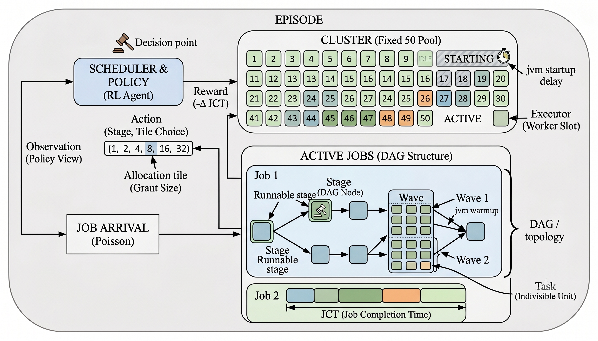
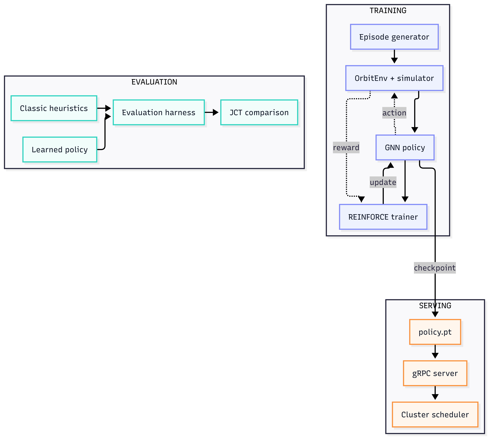
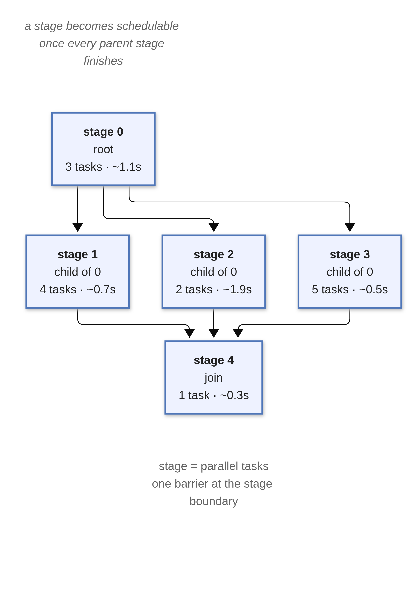
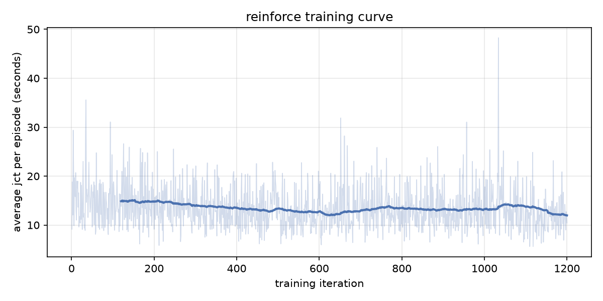
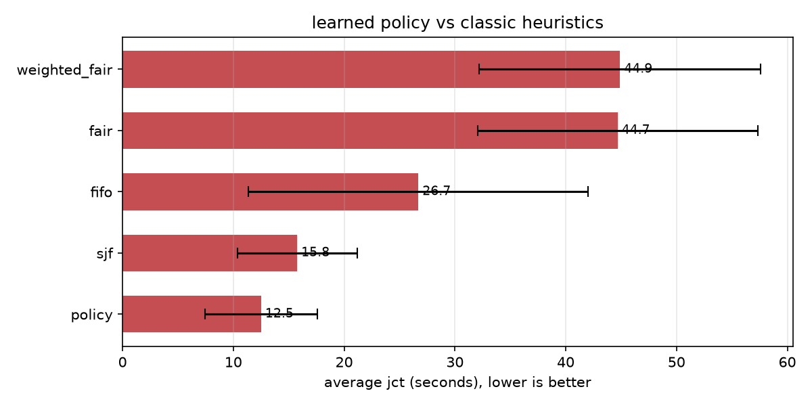

<h1 align="center">Orbit</h1>

<div align="center">


[](https://opensource.org/licenses/MIT)
[](https://www.python.org/)
[](https://pytorch.org/)
[](https://isocpp.org/)
[](https://grpc.io/)

</div>

Orbit is a reinforcement-learning based cluster scheduler for DAG-based job workflows. It reads the cluster state as a graph of job DAGs, runs it through a GNN, and learns which stage to dispatch next and how many slots to give it, trained end to end to minimize average job completion time (JCT).

---



## Terminology

- **Cluster** - the fixed pool of executors the scheduler hands out (50 by default). An executor is either idle or assigned to a job.
- **Executor** - one worker slot. Per-job accounting splits granted executors into starting (still in the jvm startup delay) and active (currently processing tasks).
- **Job** - one unit of submitted work: a DAG of stages plus a parallelism limit, the maximum number of executors it may hold at once. Jobs arrive over time under a Poisson process.
- **Stage** - a node in a job's DAG and one phase of its computation (like a stage in Spark). Each stage has a task count, an average task duration, and a max processing rate; it becomes schedulable once every parent stage completes.
- **Task** - the indivisible unit of work inside a stage. A stage is a barrier over its tasks: it completes only when every task has finished.
- **DAG** - the dependency graph of a job's stages, parent-to-child. Synthetic jobs draw one of four shapes: chain, fork-join, diamond, or random.
- **Wave** - a stage's tasks are worked in waves rather than all at once: each wave processes up to `assigned executors` tasks over one task duration, and the first wave is slower (jvm warmup). Over-subscribing a stage beyond its processing cap wastes executors.
- **Allocation tile** - the executor-grant sizes the policy can choose from: `(1, 2, 4, 8, 16, 32)`. A chosen tile is clamped to the job's available headroom.

---

## Architecture



Training rolls out episodes in the simulator and steps the policy along the gradient of negative JCT. Evaluation replays held-out episodes with the learned policy and with classic heuristics and compares average JCT. Serving loads a frozen checkpoint into a gRPC server for an external scheduler to query.

---

## Components

**Simulator core** (`src/orbit/cpp`, pybind11), a C++17 discrete-event engine exposed to Python as `orbit.core`. Jobs are DAGs of stages; tasks within a stage dispatch in waves rather than all at once, each stage pays a JVM startup cost, and over-subscribing a stage slows it down. These are the effects that make simple heuristics fail in practice, so the simulator models them instead of assuming them away.

**Workload generator** (`src/orbit/sim/workload.py`), jobs arrive under a Poisson process, and each job's DAG is one of four shapes: chain, fork-join, diamond, or random, drawn per job so the policy has to generalize across topologies.



**OrbitEnv** (`src/orbit/sim`), a Gymnasium wrapper. Observations are the full cluster graph (task counts, durations, parallelism limits, stage state, free slots). Actions are `(stage, alloc_tile)`. Reward per step is the negative JCT delta, so total episode reward is exactly `-total_jct`.

**GNN policy** (`src/orbit/agent`), a MeanConv encoder produces a stage embedding for every node, feeding two heads: one picks the next stage to dispatch, the other picks an allocation tile bounded by that stage's parallelism limit. Both heads are masked to legal actions. `policy.act()` is greedy inference, used by both evaluation and serving.

**REINFORCE trainer** (`src/orbit/train`), policy gradient with two variance-reduction tricks: a differential reward (each episode also gets rolled out with a heuristic baseline, and the agent is scored against that, not an absolute number) and a curriculum that grows episode length over training. One rollout + one Adam step (lr `3e-3`) per iteration.

**Evaluation harness** (`src/orbit/eval`), runs the policy and four heuristics on the same seeded episodes and reports mean/std JCT:

| Decider | Rule |
|---------|------|
| `fifo` | earliest-arrived runnable stage first |
| `sjf` | shortest-job-first: least remaining work |
| `fair` | equal capacity slice per runnable job |
| `weighted_fair` | fair share weighted by parallelism limit |

**gRPC server** (`src/orbit/serve`), serves a frozen policy:

```
service Scheduler {
  rpc Decide(DecideRequest) returns (DecideResponse);
}
```

`DecideRequest` carries the serialized cluster graph plus allocator state; `DecideResponse` returns `(stage_node_id, alloc_action)`. No training state on this path, just greedy inference from a loaded checkpoint.

---

## Design decisions

**C++ for the simulator.** Training burns through thousands of episodes, and a pure-Python simulator would be the bottleneck. Core logic compiles via scikit-build-core into `orbit.core`; Python stays on the ML side.

**GNN over a flat state vector.** Job count and DAG size vary episode to episode. A GNN shares parameters across nodes and is permutation-invariant, so one policy handles both a 3-job and a 50-job snapshot without padding.

**Two action heads.** Factoring "which stage, how much parallelism" into a stage head + allocation head keeps the action space small enough for REINFORCE, and a legality mask keeps every sampled action feasible.

**Differential reward instead of a critic.** A learned value function is another thing to get right; a heuristic rollout of the same episode gives a cheap, correlated baseline instead.

**gRPC serving, frozen policy.** A real scheduler (e.g. a Spark driver) may not be Python, so protobuf gives a typed contract across languages. The served policy is frozen, no online learning in production, which keeps it deterministic and easy to debug.

---

## Project Structure

```
orbit/
├── src/orbit/
│   ├── cpp/                     # C++17 discrete-event simulator (pybind11)
│   │   ├── include/orbit/       #   dag.hpp, executor.hpp, event_loop.hpp, simulator.hpp
│   │   ├── src/                 #   implementations + bindings
│   │   └── CMakeLists.txt       #   builds the _orbit_core extension
│   ├── __init__.py              # exposes orbit.core (compiled module)
│   ├── cli.py                   # `orbit` console command (health check + version)
│   ├── sim/                     # workload generator + Gymnasium environment
│   ├── agent/                   # GNN encoder, policy heads, checkpoint save/load
│   ├── train/                   # REINFORCE loop, differential baseline, curriculum
│   ├── eval/                    # heuristics + evaluation/summarize harness
│   └── serve/                   # gRPC server, service handler, client
│       └── proto/
│           └── scheduler.proto  # gRPC contract: Scheduler.Decide
├── examples/
│   └── train_and_eval.py        # one command: train, evaluate, write charts + numbers
├── tests/                       # pytest smoke tests across all modules
├── assets/                      # README diagrams + results charts
├── pyproject.toml               # build config, extras: [dev], [serve]
└── README.md
```

---

## Building

```bash
uv venv --python 3.12 .venv
uv pip install -e ".[dev,serve]" --python .venv/bin/python
```

Needs Python 3.12+, `uv` (or pip + a CMake/pybind11-capable toolchain), and a C++17 compiler (GCC 9+ / Clang 10+, CMake 3.18+). The editable install builds the C++ extension via scikit-build-core; reinstall with `--no-deps` after editing C++ sources to trigger a rebuild.

```bash
.venv/bin/python -m pytest tests/ -o addopts=""
```

---

## Results

One command, default args, ~6 minutes on a laptop:

```bash
.venv/bin/python examples/train_and_eval.py
```

Trains a fresh policy (1200 iterations, seed 0), evaluates against the four heuristics over 5 held-out seeds, and writes `assets/training_curve.png`, `assets/eval_results.png`, and `policy.pt`.





Average JCT in seconds (lower is better), across 5 seeds:

| Decider | Mean jct | vs. policy |
|---------|----------|------------|
| **policy (learned)** | **12.51** |  |
| `sjf` | 15.76 | +26% |
| `fifo` | 26.70 | +113% |
| `fair` | 44.68 | +257% |
| `weighted_fair` | 44.90 | +259% |


These are synthetic workloads on one simulated cluster and reference-grade heuristics.

---

## Serving

```python
import grpc

from orbit.agent import load_policy
from orbit.serve import SchedulerClient, build_request, serve

policy = load_policy("policy.pt")
server, bound = serve(policy, port=50051)

client = SchedulerClient(grpc.insecure_channel(f"localhost:{bound}"))
decision = client.decide(build_request(obs, info))
print(decision.stage_node_id, decision.alloc_action)
```

`build_request` turns a raw env observation into the protobuf message the policy expects. Shut down with `server.stop(0)`.

---

## Tech Stack

| Component | Technology |
|-----------|-----------|
| Simulator core | C++17, pybind11, scikit-build-core, CMake |
| Environment | Gymnasium (Python 3.12) |
| Model | PyTorch, MeanConv GNN encoder, stage + allocation heads |
| Training | REINFORCE, differential rewards, running baseline, curriculum |
| Serving | gRPC + Protocol Buffers |
| Testing | pytest (unit + smoke across all layers) |
| Packaging | uv, extras: `dev` (pytest, matplotlib), `serve` (grpcio, grpcio-tools, protobuf) |
